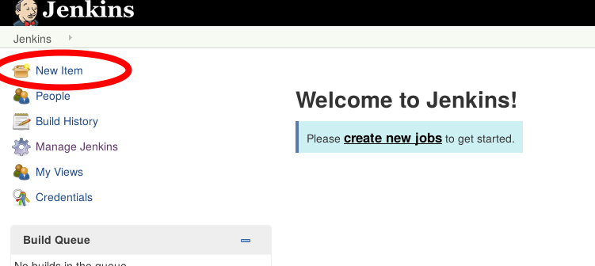
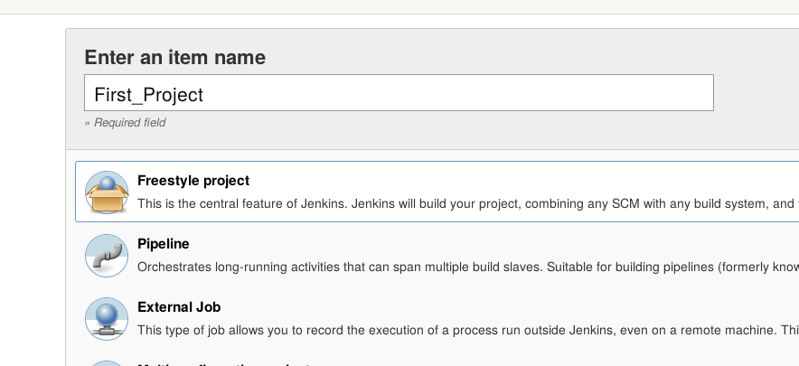
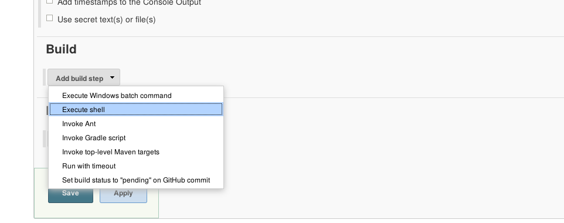
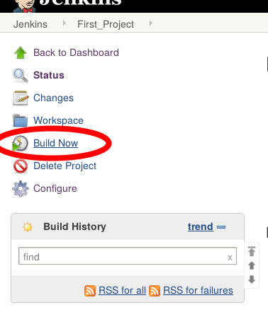
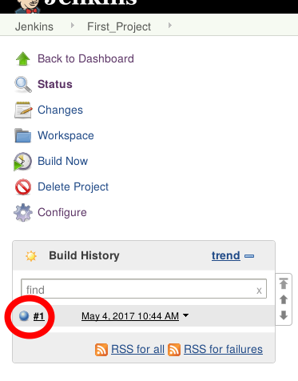
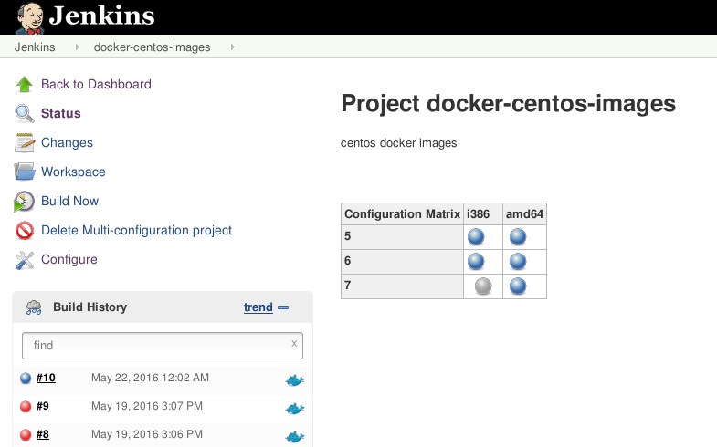

!SLIDE bullets noprint
# Hello Jenkins!

* Let's get started!

!SLIDE smbullets small
# Lab ~~~SECTION:MAJOR~~~.~~~SECTION:MINOR~~~: Creating Your First Job
* Objective:
  * Create a Jenkins Job
* Steps:
  * Create a 'Freestyle Project'
  * Add a 'Execute shell'-build step
  * Start the Job and check its output

!SLIDE supplemental exercises
# Lab ~~~SECTION:MAJOR~~~.~~~SECTION:MINOR~~~: Creating Your First Job

## Objective:

****

* Create a Jenkins job

## Steps:

****

* Create a 'Freestyle Project'
* Add a 'Execute shell'-build step
* Start the Job and check its output

!SLIDE supplemental solutions
# Lab ~~~SECTION:MAJOR~~~.~~~SECTION:MINOR~~~: Proposed Solution

****

## Create a Jenkins job

****

## Create a 'Freesyle Project'

~~~PAGEBREAK~~~

## Add a 'Execute shell'-build step

Enter:

    @@@ shell
	echo "Hello, Jenkins!"

## Start the Job and check its output

!SLIDE center noprint
#Job Status Page

!SLIDE printonly
#Job Status Page

!SLIDE bullets small noprint
# Job Status Page
* Changes  
Can show a change log (requires an add-on)
* Workspace  
Contains files used and created by a Build

> Note: No guarantee for files in the workspace to persist or be
> cleaned up after a build (There are Plugins for that)

* Build History  
Past Builds, number can be configured.
Contains more detailed state and progress information

~~~SECTION:notes~~~

Wenn der Job etwa auf einem anderen Server gebaut wird als vorher fehlt der
Workspace. (shared workspace möglich)
Wenn man sich nicht darum gekümmert hat keine wichtigen datein im workspace
haben.
Vergangene builds behalten auch die Ergebnise, nicht nur logs

~~~ENDSECTION~~~

!SLIDE smbullets printonly
# Job Status Page
* Changes  
Can show a change log (requires an add-on)
* Workspace  
Contains files used and created by a Build

> Note: No guarantee for files in the workspace to persist or be
> cleaned up after a build (There are Plugins for that)

* Build History  
Past Builds, number can be configured.
Contains more detailed state and progress information

!SLIDE smbullets
# About Exit Codes
* Jenkins Job states come in three flavours
 - Blue: Success! Job exited with true or 0
 - Red: Failure! Job exited with false or !0
 - Yellow: Unstable. Post-build actions can set this code
