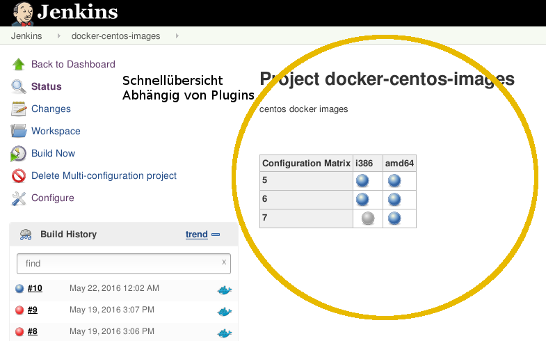
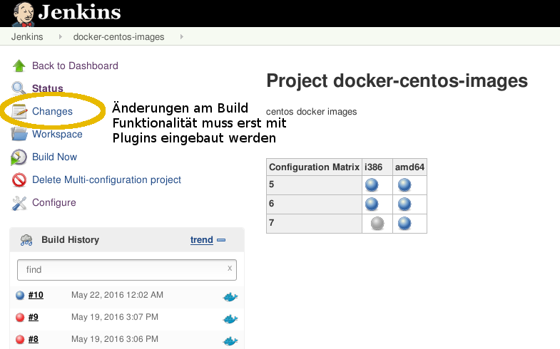
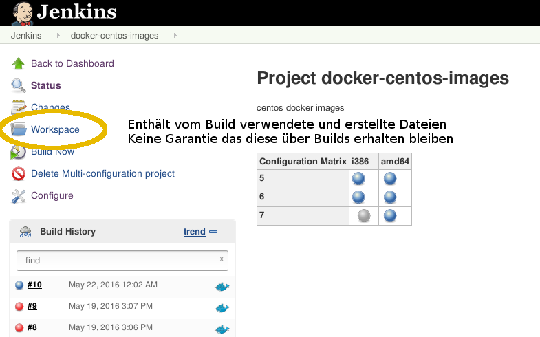
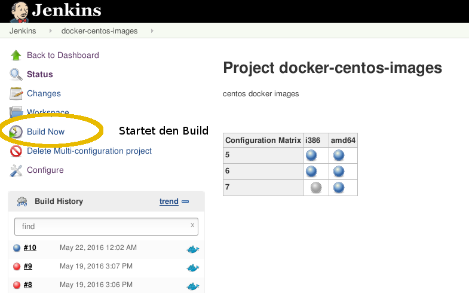
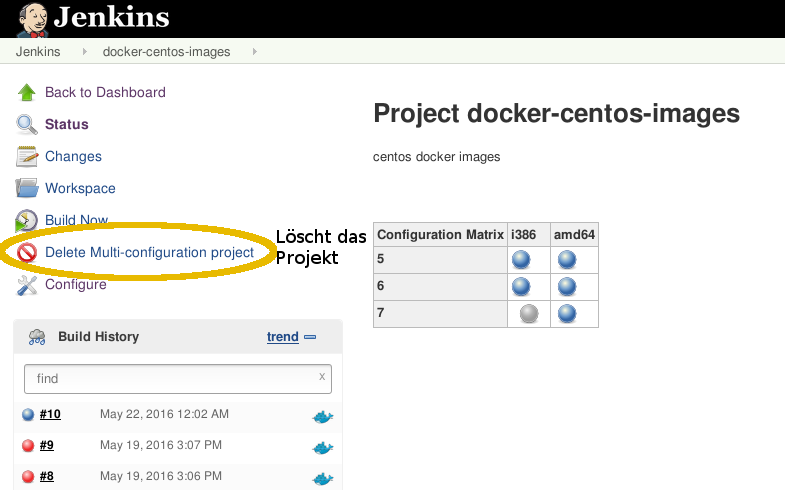
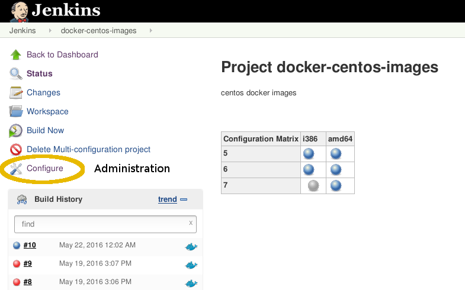
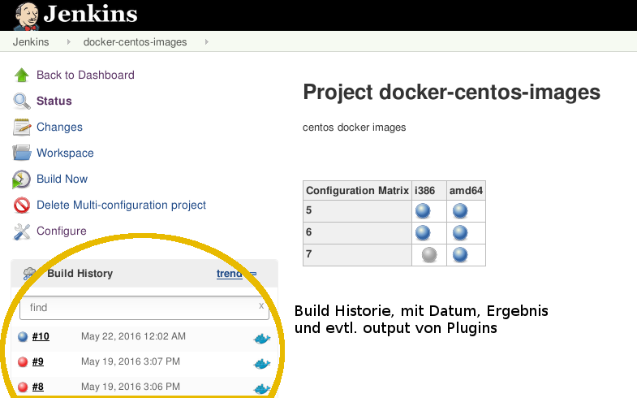
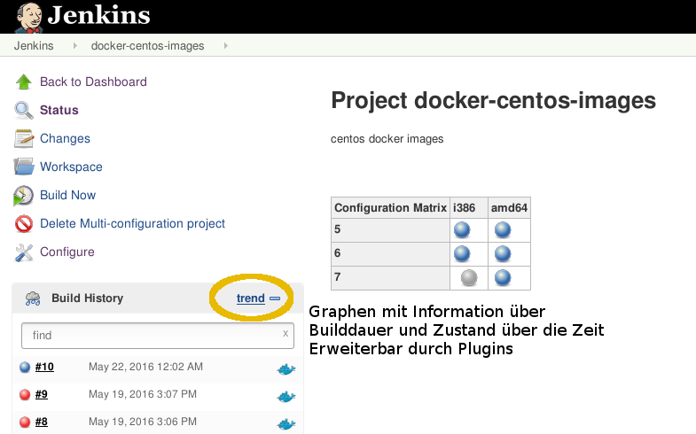

!SLIDE subsection
#~~~SECTION:MAJOR~~~.~~~SECTION:MINOR~~~ Hello, Jenkins!

!SLIDE
#Einen neuen Job erstellen

* Auf `New Item` klicken
* Name eingeben und Freestyle Projekt auswählen
* `Build` -> `Execute Shell`

## Code:

    @@@ sh
    echo "Hello Jenkins"
    exit 0 	  				 	 	 	   	 	  	   		  	 

!SLIDE center printonly
#Die Statusseite

!SLIDE center printonly
#Die Statusseite

!SLIDE center printonly
#Die Statusseite

!SLIDE center printonly
#Die Statusseite

!SLIDE center printonly
#Die Statusseite

!SLIDE center printonly
#Die Statusseite

!SLIDE center printonly
#Die Statusseite

!SLIDE center printonly
#Die Statusseite

!SLIDE center printonly
#Die Statusseite

!SLIDE bullets  small
#Die Statusseite
* Changes  
Kann Changelog anzeigen (muss eingerichtet werden)
* Workspace  
Enthält Dateien vom build gebraucht und erstellt werden

> Achtung: Keine Garantie das Datein im Workspace erhalten bleiben.
> Daten werden auch nicht aufgeräumt (Plugin dafür existiert)

* Build History  
Vergangene Builds, Anzahl konfigurierbar
Enthält genauere Status und Ablaufsinformationen
Verfällt bei vielen Projektypen nach Jenkins Neustart

~~~SECTION:notes~~~

Wenn der Job etwa auf einem anderen Server gebaut wird als vorher fehlt der
Workspace. (shared workspace möglich)
Wenn man sich nicht darum gekümmert hat keine wichtigen datein im workspace
haben.
Vergangene builds behalten auch die Ergebnise, nicht nur logs

~~~ENDSECTION~~~
