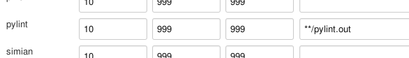

!SLIDE subsection
# ~~~SECTION:MINOR~~~ Code Qualität überprüfen

!SLIDE bullets incremental
#Vorbereitung
* Plugin installieren:
 - Violations

~~~SECTION:notes~~~

TODO: Corbetura mit nosexcoverage

~~~ENDSECTION~~~

!SLIDE smbullets incremental
#Den Job editieren
* Auf den Job klicken
* `Configure`
* Unter `Post-build Actions` -> `Report Violations`

~~~SECTION:notes~~~

TODO: Erklärung Grenzwerte, Erklärung ** foo

~~~ENDSECTION~~~

!SLIDE code noprint
#Execute Shell

  PYENV_HOME=$WORKSPACE/.venv/    
  if [ -d $PYENV_HOME ]; then
      rm -rf $PYENV_HOME
  fi  
  virtualenv --no-site-packages $PYENV_HOME
  . $PYENV_HOME/bin/activate
  pip install --quiet pylint
  pip install $WORKSPACE/
  pylint -f parseable suchmaschine/ | tee pylint.out

~~~SECTION:notes~~~

$WORKSPACE: Jenkins env  
Klick 'See the list of available environment variables' unter execute shell  

~~~ENDSECTION~~~

!SLIDE bullets
#Das Ergebniss

ES GEHT NET OMGWTFBBQ
