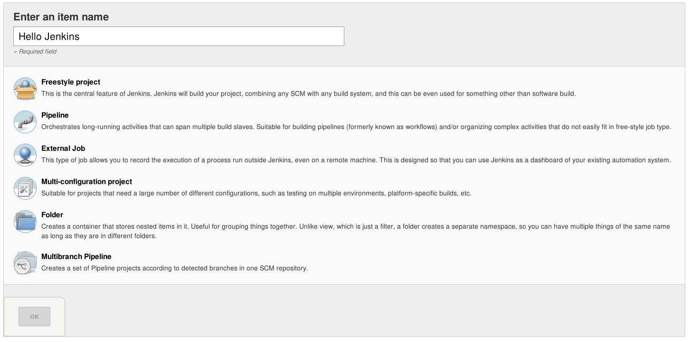
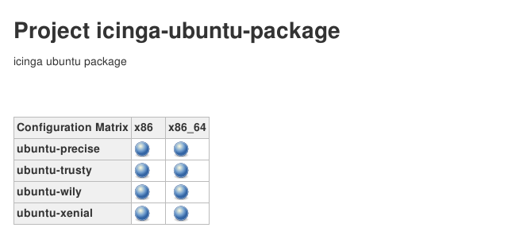

!SLIDE center noprint
# Project-types

~~~SECTION:notes~~~

(Auf new Project klicken um Typen zu zeigen)

~~~ENDSECTION~~~

!SLIDE smbullets
# Project-types
* Many different types exists
* More come as plugins
* Types are not 'default-sets' but very much different from each other

~~~SECTION:notes~~~
Das heißt: Man kann ein Multi conf project nicht mit einem freestyle nachbauen
~~~ENDSECTION~~~

!SLIDE bullets noprint
# Freestyle
* Most simple kind of project
* Simple process possible through chaining

~~~SECTION:notes~~~

Nachteil: Unübersichtlich
Wir verwenden Freestyle Projekte weil es so weniger Optionen zu erklären gibt
TODO: Extra Teil über pipeline projekte

~~~ENDSECTION~~~

!SLIDE smbullets printonly
# Freestyle
* Most simple kind of project
* Simple process possible through chaining

!SLIDE smbullets
# Multi-configuration project

* Useful for jobs with many parameters
* Axes allow starting many builds with preconfigured parameters at the same time
* Used in the Icinga project to run Builds on on all Architecture-OS-combinations

!SLIDE bullets noprint
# External Job
* Use Jenkins to monitor program execution
* Useful for process management
* Not part of this training

!SLIDE smbullets printonly
# External Job
* Use Jenkins to monitor program execution
* Useful for process management
* Not part of this Training

!SLIDE bullets noprint
# Pipeline
* Once known as 'Workflow'
* Uses a declarative Domain Specific Language (DSL)
* 'Blue Ocean', a special pipeline UI

~~~SECTION:notes~~~

Ist ein Extra Thema, kann bei Intresse und genug Zeit noch nachgeschoben werden

~~~ENDSECTION~~~

!SLIDE bullets printonly
# Pipeline
* Once knows as 'Workflow'
* Uses a declarative Domain Specific Language (DSL)
* Can be integrated with 'Blue Ocean'
  - Pipeline specific UI
