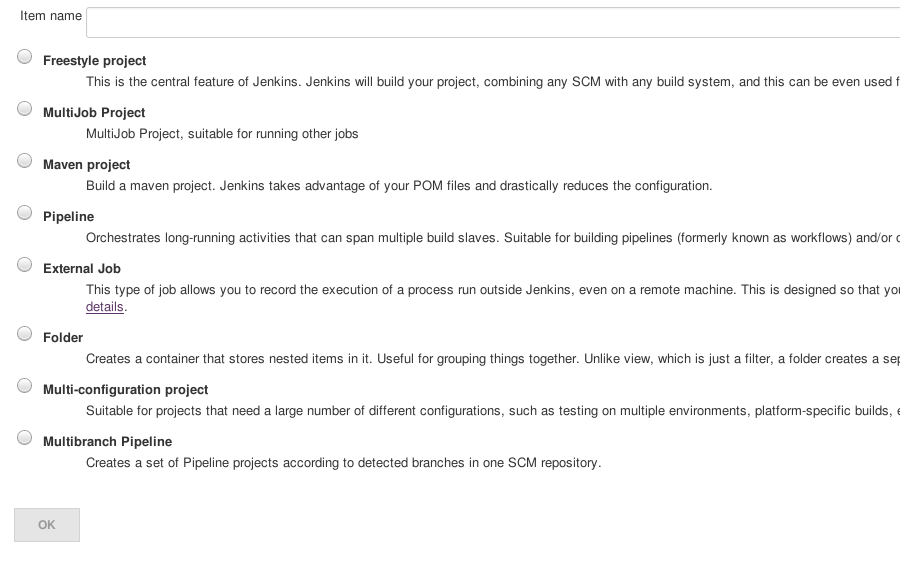

!SLIDE subsection
#~~~SECTION:MAJOR~~~.~~~SECTION:MINOR~~~ Projekttypen

!SLIDE center
# Viele bunte Projektypen

~~~SECTION:notes~~~

(Auf new Project klicken um Typen zu zeigen)

~~~ENDSECTION~~~

!SLIDE bullets incremental
# Freestyle
* Simpleste Projektform
* Ermöglichen simple Prozessabbildung durch Aneinanderreihung
* Historie und Logs überstehen keinen Jenkins-Neustart
* Dem Workflow/Pipeline Job in jeder Hinsicht unterlegen

~~~SECTION:notes~~~

Wir verwenden Freestyle Projekte weil es so weniger Optionen zu erklären gibt
TODO: Extra Teil über pipeline projekte

~~~ENDSECTION~~~

!SLIDE bullets incremental
#Multiconfiguration
[Bild von matrix build vom Buildserver]

* Geignet für Jobs mit vielen Parametern
* Achsen erlauben es schnell sehr viele builds zu konfigurieren/starten
* z.B. Builds die auf mehreren os versionen und Architekturen laufen sollen

!SLIDE incremental
#External Job
* Verwandelt Jenkins in ein Monitoring-System
* Nicht relevant für dieses Training
* Ausserdem hat jeder schon Icinga fürs Monitoring

~~~SECTION:notes~~~

Letzten Satz irgendwie witzig machen, sonst Übelkeit

~~~ENDSECTION~~~

!SLIDE incremental noprint
#Gibts noch mehr?
Klar!
Und zwar als ...

~~~SECTION:notes~~~

Goldene Brücke zu Plugins :D :) :| :( Dämlich

~~~ENDSECTION~~~

!SLIDE bullets printonly
#Weitere Plugins
* Installierbar als Plugins
* Zum Beispiel:
  - Workflow/Plugin
  - MultiJob
