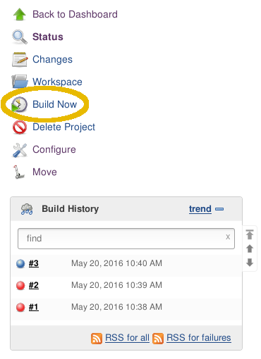
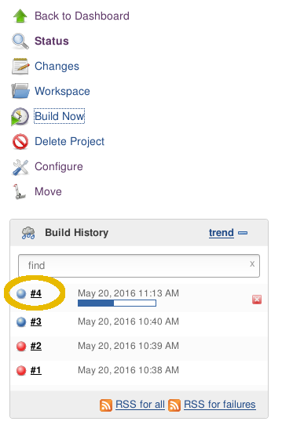

!SLIDE subsection
#~~~SECTION:MAJOR~~~ Creating A Project

!SLIDE bullets noprint
# Preparation
* Install required plugins:
 - Git Plugin
* Install required build tools:
 - Python 2.7
 - Pip
 - virtualenv

    @@@ sh
    PYENV_HOME="$WORKSPACE"/.venv/
    if [ -d "$PYENV_HOME" ]; then
        rm -rf "$PYENV_HOME"
    fi
    virtualenv --no-site-packages "$PYENV_HOME"
    . "$PYENV_HOME"/bin/activate
    pip install "$WORKSPACE/"

~~~SECTION:notes~~~

"PYENV .. $WORKSPACE" $WORKSPACE erklären, andere vars zeigen  
"if..rm..fi" Geht sicher das nichts von vorherigen builds bleibt  
"virtualenv..HOME" Erstellt isolierte python umgebung
" . ... activate" Wechselt in isollierte umgeben (mit imports erklären)
"pip install" Installiert projekt in virtualenv

~~~ENDSECTION~~~

!SLIDE noprint
#Build it!

!SLIDE noprint
#Build it!

~~~SECTION:notes~~~

Live Konsolen output ist zu sehen, interessant zum debuggen

~~~ENDSECTION~~~

!SLIDE smbullets small
# Lab ~~~SECTION:MAJOR~~~.~~~SECTION:MINOR~~~: Creating Your First Project
* Objective:
 * Set up the example project and start it
* Steps:
 * Create a new Freestyle Project
 * Set up Source Code Management
 * Copy the Build Step
 * Save the Project
 * Build it!

!SLIDE supplemental exercises
# Lab ~~~SECTION:MAJOR~~~.~~~SECTION:MINOR~~~: Creating Your First Project

## Objective:

****

* Set up the example project and start it

## Steps:

****

* Create a new Freestyle Project
* Set up Source Code Management
* Copy the Build Step
* Save the Project
* Build it!

!SLIDE supplemental solutions
# Lab ~~~SECTION:MAJOR~~~.~~~SECTION:MINOR~~~: Proposed Solution

****

## Creating Your First Project

****

## Create a new Freestyle Project

[TODO: Screenshot]
`Create New Project` -> `Freestyle Project + name`

## Set up Source Code Management
[TODP: Screenshot]
git@localhost:/opt/git/training.git

## Copy the Build Step

Execute Shell

    @@@ sh
    PYENV_HOME="$WORKSPACE"/.venv/
    if [ -d "$PYENV_HOME" ]; then
        rm -rf "$PYENV_HOME"
    fi
    virtualenv --no-site-packages "$PYENV_HOME"
    . "$PYENV_HOME"/bin/activate
    pip install "$WORKSPACE/"

## Save the Project

[TODO: Screenshot]

## Build it!

[TODO: Screenshot]
