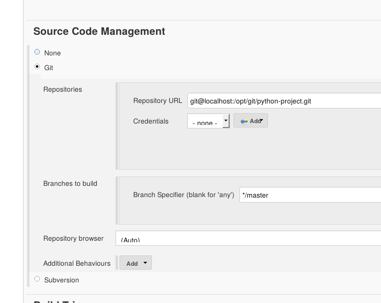

!SLIDE subsection
#~~~SECTION:MAJOR~~~ A Proper Project

!SLIDE bullets noprint
#A Proper Project
* The "Hello Jenkins" Job shows basic usage of Jobs
* Next we will create a job that does a bit more

!SLIDE smbullets noprint
# Preparation
Things to consider when before creating a new Job:
* Are all required Plugins installed?
  - We will only be needing the Git Plugin (Preinstalled)
  - More about plugins next
* Are all my required build tools installed?
  - We will need: Python 2.X, python-pip and python-virtualenv
  - They're all already installed in this case

~~~SECTION:notes~~~

"PYENV .. $WORKSPACE" $WORKSPACE erklären, andere vars zeigen  
"if..rm..fi" Geht sicher das nichts von vorherigen builds bleibt  
"virtualenv..HOME" Erstellt isolierte python umgebung
" . ... activate" Wechselt in isollierte umgeben (mit imports erklären)
"pip install" Installiert projekt in virtualenv

~~~ENDSECTION~~~

~~~SECTION:notes~~~

Live Konsolen output ist zu sehen, interessant zum debuggen

~~~ENDSECTION~~~

!SLIDE smbullets small
# Lab ~~~SECTION:MAJOR~~~.~~~SECTION:MINOR~~~: A Proper Project
* Objective:
  * Set up the python build job
* Steps:
  * Add the ssh key
  * Create a new Freestyle Project
  * Set up Source Code Management
  * Add the Build Step
  * Build it!

!SLIDE supplemental exercises
# Lab ~~~SECTION:MAJOR~~~.~~~SECTION:MINOR~~~: A Proper Project

## Objective:

****

* Set up the python build job

## Steps:

****

* Add the ssh key
* Create a new Freestyle Project
* Set up Source Code Management
* Add the Build Step
* Build it!

~~~SECTION:notes~~~

Wenn es fehlschlägt, wahrscheinlich wegen Leerzeichen im Projektnamen

~~~ENDSECTION~~~

!SLIDE supplemental solutions
# Lab ~~~SECTION:MAJOR~~~.~~~SECTION:MINOR~~~: Proposed Solution

****

## Set up the python build job

****

## Add the ssh key

    @@@ Shell
	sudo cp -r ~/jenkinsk

## Create a new Freestyle Project

* Create a new project
* Enter a name
* Select 'Freestyle Project'

## Set up Source Code Management

~~~PAGEBREAK~~~

## Add the Build Step

Execute Shell

    @@@ sh
    PYENV_HOME="$WORKSPACE"/.venv/
    if [ -d "$PYENV_HOME" ]; then
        rm -rf "$PYENV_HOME"
    fi
    virtualenv --no-site-packages "$PYENV_HOME"
    . "$PYENV_HOME"/bin/activate
    pip install "$WORKSPACE/"

## Build it!

!SLIDE 
