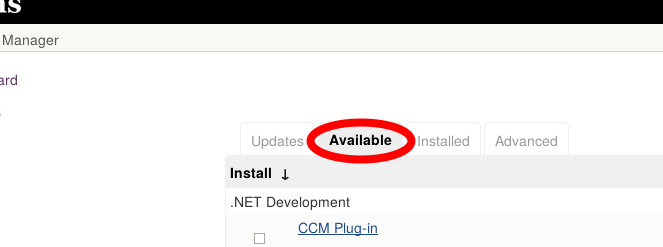
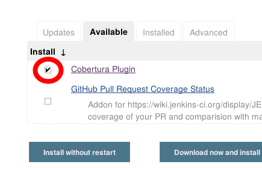
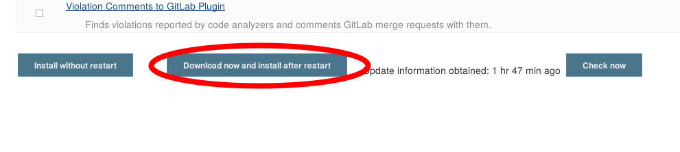
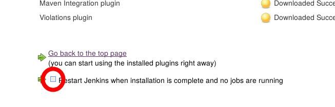

!SLIDE bullets noprint
# Jenkins And Plugins
Plugins are a big selling point of Jenkins

* Can be installed directly from the web interface
  - Can also be installed manually
* Each plugin is documented in the Wiki
* Written in Java
* 'Dependency Hell' can be an issue

~~~SECTION:notes~~~

Gute Developer Guidelines erwähnen

~~~ENDSECTION~~~

!SLIDE smbullets printonly
# Jenkins And Plugins
Plugins are a big selling point of Jenkins

* Can be installed directly from the web interface
  - Can also be installed manually 
* Each plugin is documented in the Wiki
* Written in Java
* Often highly dependent on each other

!SLIDE smbullets small
# Lab ~~~SECTION:MAJOR~~~.~~~SECTION:MINOR~~~: Installing A Plugin
* Objective:
  * Install the 'Cobertura' Plugin
* Steps:
  * Navigate to the Plugin Manager
  * Search for and install the 'Cobertura' and 'Violations' plugin
  * Restart Jenkins

!SLIDE supplemental exercises
# Lab ~~~SECTION:MAJOR~~~.~~~SECTION:MINOR~~~: Installing A Plugin

## Objective:

****

* Install the 'Cobertura' Plugin

## Steps:

****

* Navigate to the Plugin Manager
* Search for and install the 'Cobertura' and 'Violations' plugins
* Restart Jenkins

!SLIDE supplemental solutions
# Lab ~~~SECTION:MAJOR~~~.~~~SECTION:MINOR~~~: Proposed Solution

****

## Install the 'Cobertura' and 'Violations' plugins

****

## Navigate to the Plugin Manager

* `Manage Jenkins` ->
* `Manage Plugins`

## Search for and install the 'Cobertura' and 'Violations' plugins

## Restart Jenkins

~~~SECTION:notes~~~

Erwähnen: wir brauchen das Plugin später
Anhand gitplugin Wikiseite zeigen.
es gibt einige 'Git Plugins' aber wir sollen das normale

~~~ENDSECTION~~~

!SLIDE bullets noprint
# Worthwhile Plugins?
* During the course of this training we will meet a few helpful or essential Plugins.
* Often plugins are highly specific or extensions of other plugins

~~~SECTION:notes~~~

Anhand gitplugin Wikiseite zeigen.
es gibt einige 'Git Plugins' aber wir sollen das normale

~~~ENDSECTION~~~
