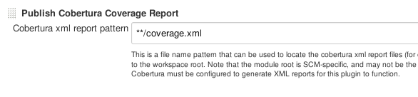
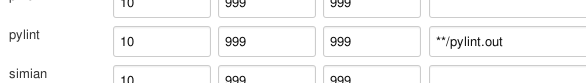
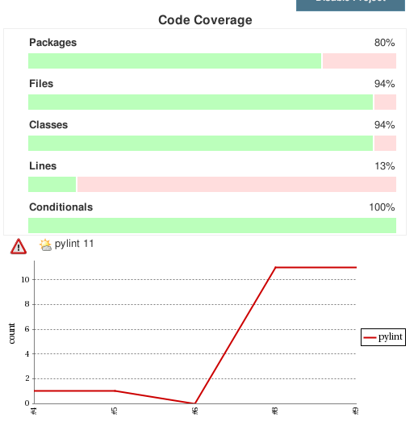

!SLIDE smbullets noprint
# Generating Metrics

## Preparation

* Make sure the two plugins are installed
 - Violations
 - Cobertura

~~~SECTION:notes~~~

Teilnehmer sollen selbst addons installieren
Kein Neustart erforderlich

~~~ENDSECTION~~~

!SLIDE smbullets printonly
# Generating Metrics

## Preparation

* Make sure the two plugins are installed
 - Violations
 - Cobertura

!SLIDE smbullets 
# Edit The Job
* Configure job
* `Post-build Actions` -> `Publish Cobertura Report`  
 -> '\*\*/covarage.xml'  

* `Post-build Actions` -> `Report Violations`  
 -> '\*\*/pylint.out'  

~~~SECTION:notes~~~

TODO: Erklärung Grenzwerte, Erklärung ** foo
Ant-style pfade 

~~~ENDSECTION~~~

!SLIDE small code
# Execute Shell
    @@@ sh
    PYENV_HOME="$WORKSPACE"/.venv/    
    if [ -d "$PYENV_HOME" ]; then
        rm -rf "$PYENV_HOME"
    fi  
    virtualenv --no-site-packages "$PYENV_HOME"
    . "$PYENV_HOME"/bin/activate
    pip install --quiet pylint
    pip install --quiet nosexcover
    pip install "$WORKSPACE/"
    pylint -f parseable "$WORKSPACE" | tee pylint.out
    nosetests --with-xcoverage --with-xunit \
      --cover-package="$WORKSPACE" --cover-erase

~~~SECTION:notes~~~

"pip --quiet ..." installiert aus dem Netz, output interssiert nicht
"pylint ..." Statische code analyse (anhand output erklären)
"nosetest ..." python unit tests, überprüfen einzelne code teile

~~~ENDSECTION~~~

!SLIDE noprint
# The Result

~~~SECTION:notes~~~

Gute Übersicht über Code Qualität und Testcoverage.  
nosexcoverage zeigt auch die coverage der packages im virtualenv an, sonst
würde nichts zu sehen sein (suchmaschine hat keine tests)

Falls das nicht geht wegen __init__.py  
$echo "__all__ = ['suchmaschine']" > __init__.py

~~~ENDSECTION~~~
