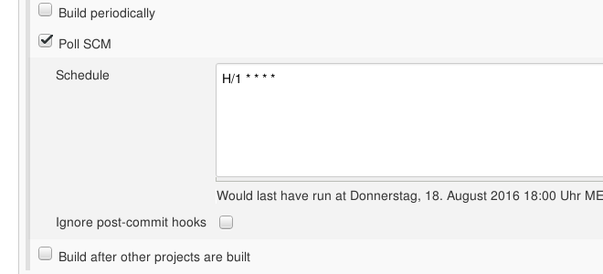

!SLIDE noprint
# What A Bad Result
The result was not to our liking.

But we don't want to push the build button again

!SLIDE bullets noprint
# Triggered Builds
* Triggered Builds allow Jenkins to start a build without our help
* Greatly decreases the required interaction

!SLIDE smbullets printonly
# Triggered Builds
* Triggered Builds allow Jenkins to start a build without our help
* Greatly decreases the required interaction

!SLIDE bullets noprint
# Automatic Builds (Trigger)
* `Build after other projects are built`
  - Allows to chain builds
* `Build periodically`
  - Starts the job following a cron-like schedule
* `Poll SCM`
  - Periodically polls a SCM and starts the build when there are changes

~~~SECTION:notes~~~

Schedule TODO: Irgendetwas das nicht so lange dauert wie der nächste Abschnitt
damit der build fertig ist wenn man dazu zurückkehrt.

~~~ENDSECTION~~~

!SLIDE smbullets printonly
# Automatic Builds (Trigger)
* `Build after other projects are built`
  - Allows to chain builds
* `Build periodically`
  - Starts the job following a cron-like schedule
* `Poll SCM`
  - Periodically polls a SCM and starts the build when there are changes

!SLIDE smbullets small
# Lab ~~~SECTION:MAJOR~~~.~~~SECTION:MINOR~~~: Add A Trigger
* Objective:
 * Add a trigger and push an update
* Steps:
 * Navigate to the Projects configuration page
 * Add a `Poll SCM` trigger
 * Set the schedule to 'every minute'
 * Apply the 'perfect patch'
 * Push the changes

!SLIDE supplemental exercises
# Lab ~~~SECTION:MAJOR~~~.~~~SECTION:MINOR~~~: Add A trigger

## Objective:

****

* Add a trigger and push an update

## Steps:

****

* Navigate to the Projects configuration page
* Add a `Poll SCM` trigger
* Set the schedule to 'every minute'
* Apply and push the 'perfect patch'

!SLIDE supplemental solutions
# Lab ~~~SECTION:MAJOR~~~.~~~SECTION:MINOR~~~: Proposed Solution

****

## Add a trigger

****

## Navigate to the Projects configuration page

You can do this by yourself

## Add a `Poll SCM` trigger

* 'Build Triggers'
* Tick 'Poll SCM'

## Set the schedule to 'every minute'

> You can click the '?' to see the documentation of the scheduling format

## Apply and push the 'perfect patch'

    @@@ Sh
	$ cd suchmaschine
	$ git am perfect.patch
	$ git push

