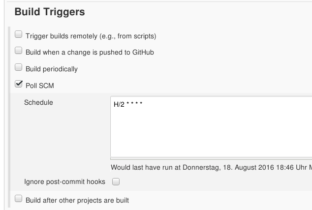

!SLIDE noprint
# What A Bad Result
The result was not to our liking.

But we don't want to push the build button again

!SLIDE bullets noprint
# Triggered Builds
* Triggered Builds allow Jenkins to start a build without our help
* Greatly decreases the required interaction

!SLIDE smbullets printonly
# Triggered Builds
* Triggered Builds allow Jenkins to start a build without our help
* Greatly decreases the required interaction

!SLIDE smbullets noprint
# Automatic Builds (Trigger)
* `Build after other projects are built`
  - Allows to chain builds
* `Build periodically`
  - Starts the job following a cron-like schedule
* `Poll SCM`
  - Periodically polls an SCM and starts the build when there are changes

~~~SECTION:notes~~~

SCM: Source Control Management aussprechen, erklären: Versionskontrolle

~~~ENDSECTION~~~

!SLIDE smbullets printonly
# Automatic Builds (Trigger)
* `Build after other projects are built`
  - Allows to chain builds
* `Build periodically`
  - Starts the job following a cron-like schedule
* `Poll SCM`
  - Periodically polls an SCM and starts the build when there are changes

!SLIDE smbullets small
# Lab ~~~SECTION:MAJOR~~~.~~~SECTION:MINOR~~~: Add A Trigger
* Objective:
 * Add a trigger and push an update
* Steps:
 * Navigate to the Projects configuration page
 * Add a `Poll SCM` trigger
 * Set the schedule to 'every minute'
 * Apply and push the patch
 * Wait for Jenkins to start the build itself

~~~SECTION:notes~~~

Indendation: Error docstrings erwähnen

~~~ENDSECTION~~~

!SLIDE supplemental exercises
# Lab ~~~SECTION:MAJOR~~~.~~~SECTION:MINOR~~~: Add A trigger

## Objective:

****

* Add a trigger and push an update

## Steps:

****

* Navigate to the Projects configuration page
* Add a `Poll SCM` trigger
* Set the schedule to 'every minute'
* Apply and push the patch
* Wait for Jenkins to start the build itself

!SLIDE supplemental solutions
# Lab ~~~SECTION:MAJOR~~~.~~~SECTION:MINOR~~~: Proposed Solution

****

## Add a trigger

****

## Navigate to the Projects configuration page

* The option we need is under 'Build Triggers'

## Add a `Poll SCM` trigger

* 'Build Triggers'
* Tick 'Poll SCM'

## Set the schedule to 'every two minutes'

* Clicking the '?' displays documentation for scheduling format

~~~PAGEBREAK~~~

## Apply and push the patch

    @@@ Sh
	$ cd ~/searchengine
	$ git am 0001-Fix-syntax.patch
	$ git push

## Wait for Jenkins to start the build itself
