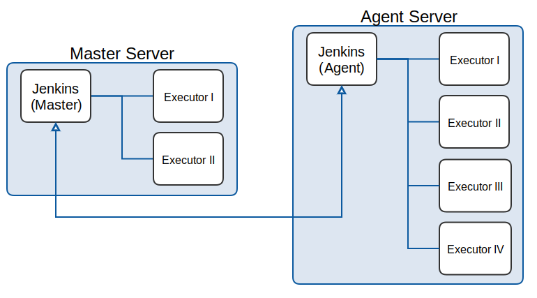

!SLIDE subsection
#~~~SECTION:MAJOR~~~ Architektur und Startup

!SLIDE center noprint
#Was wir schon haben

~~~SECTION:notes~~~

Eine Installation mit beliebig vielen Executoren

~~~ENDSECTION~~~

!SLIDE center printonly
#Was wir schon haben

!SLIDE center noprint
#Was wir wollen

~~~SECTION:notes~~~

Volles Jenkins nur auf Master.
Webserver nur auf Master.
Agents werden vom master via ssh autmatisch installiert und gestartet.
Kommunikation via tcp/ip.

~~~ENDSECTION~~~

!SLIDE center noprint
#Was wir wollen

!SLIDE
#Agent via SSH
Master benötigt nur SSH-Zugangsdaten zum Server des Agenten, der Rest
geschieht automatisch.

Eventuelle Tools (python, virtualenv...) die zum ausführen von Jobs gebraucht
werden, müssen selbst installiert werden.

~~~SECTION:notes~~~

Tools sind schon vorinstalliert (ausser virtualenv, geplanter fehlschlag)

~~~ENDSECTION~~~

!SLIDE bullets noprint
#Alternative Startmöglichkeiten
* WMI und DOM auf Windows
* JNLP (Grafisch)
* Eigenes Script
 - Jenkins verwendet stdin/out zur Kommunikation.

~~~SECTION:notes~~~

JNLP: Java Network Launch Protocol
Eigenes Script: slave.jar kommuniziert nicht von selbst mit jenkins

~~~ENDSECTION~~~

!SLIDE smbullets printonly
#Alternative Startmöglichkeiten
* WMI und DOM auf Windows
* JNLP (Grafisch)
* Eigenes Script
 - Jenkins verwendet stdin/out zur Kommunikation.

