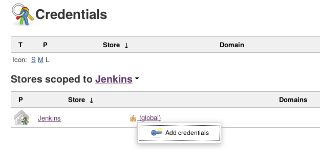

!SLIDE smbullets
#Credentials
* Not used by a user but Jenkins itself
* Jenkins has its own 'password-manager'
* Credentials are used in various places e.g:
  - Authenticating with a Git server
  - Bindings (within jobs)
  - Controlling Agents with SSH

!SLIDE smbullets small
# Lab ~~~SECTION:MAJOR~~~.~~~SECTION:MINOR~~~: Adding Credentials
* Objective:
 * Allow the jenkins user to ssh' into the Agent machine
* Steps:
 * Navigate to the `Credentials` page
 * Add an SSH key to the jenkins user

!SLIDE supplemental exercises
# Lab ~~~SECTION:MAJOR~~~.~~~SECTION:MINOR~~~: Adding Credentials

## Objective:

****

* Allow the jenkins user to ssh' into the Agent machine

## Steps:

****

* Navigate to the `Credentials` page
* Add an SSH key to the jenkins user

!SLIDE supplemental solutions
# Lab ~~~SECTION:MAJOR~~~.~~~SECTION:MINOR~~~: Proposed Solution

****

## Allow the jenkins user to ssh' into the Agent machine

****

## Navigate to the `Credentials` Page

* Click the `Credentials` link in the leftside menu

## Add an SSH key to the jenkins user

* ID will be autofilled
