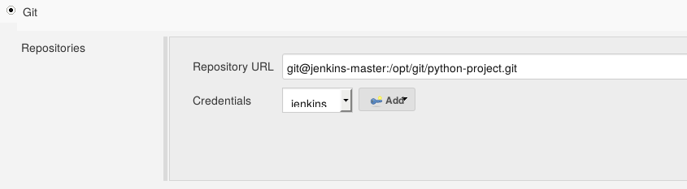

!SLIDE bullets noprint
# All Set!
* You are now ready to add your Agent
* Start the Jenkins-Agent VM if you have not done so already

!SLIDE smbullets small
# Lab ~~~SECTION:MAJOR~~~.~~~SECTION:MINOR~~~: Adding And Using Agents
* Objective:
 * Add an agent and build your project on it
* Steps:
 * Add the agent using the credentials
 * Configure the project so it runs on the agent only
 * Update the git repo

!SLIDE supplemental exercises
# Lab ~~~SECTION:MAJOR~~~.~~~SECTION:MINOR~~~: Adding And Using Agents

## Objective:

****

* Add an agent and build your project on it

## Steps:

****

* Add the agent using the credentials
* Configure the project so it runs on the agent only
* Update the git repo

!SLIDE supplemental solutions
# Lab ~~~SECTION:MAJOR~~~.~~~SECTION:MINOR~~~: Proposed Solution

****

## Add an agent and build your project on it

****

## Add the agent using the credentials

* Manage Jenkins ->
* Manage Nodes ->
* New Node

* Host Key Verification is currently broken

~~~PAGEBREAK~~~

## Configure the project so it runs on the agent only

* Set a label for the node (In the nodes config)

* Go to the projects settings
 - 'Restrict where this project can be run'
 - Enter the nodes label

## Update the git repo
* The git repo only exists on the Jenkins master
* Used credentials will be managed by Jenkins

