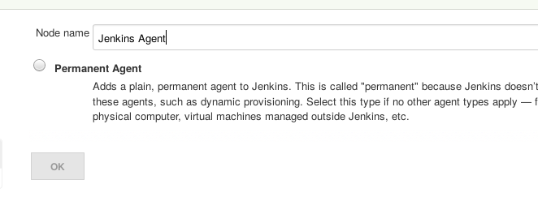
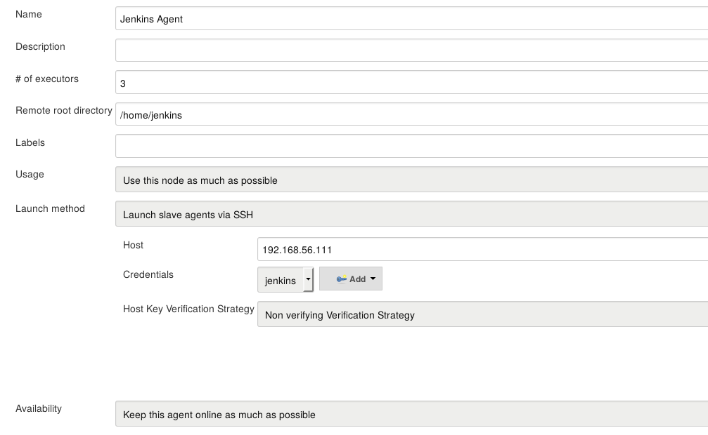
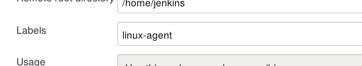
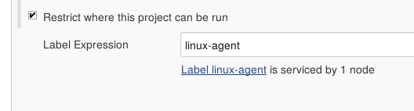

!SLIDE smbullets small
# Lab ~~~SECTION:MAJOR~~~.~~~SECTION:MINOR~~~: Adding And Using Agents
* Objective:
 * Add an agent and build your project on it
* Steps:
 * Add the agent using the credentials
 * Configure the project so it runs on the agent only
 * Use the information from the log to fix build errors

!SLIDE supplemental exercises
# Lab ~~~SECTION:MAJOR~~~.~~~SECTION:MINOR~~~: Adding And Using Agents

## Objective:

****

* Add an agent and build your project on it

## Steps:

****

* Add the agent using the credentials
* Configure the project so it runs on the agent only
* Use the information from the log to fix build errors

!SLIDE supplemental solutions
# Lab ~~~SECTION:MAJOR~~~.~~~SECTION:MINOR~~~: Proposed Solution

****

## Add an agent and build your project on it

****

## Add the agent using the credentials

* Manage Jenkins ->
* Manage Nodes ->
* New Node

* Host Key Verification is currently broken

## Configure the project so it runs on the agent only

* Set a label for the node (In the nodes config)

* Go to the projects settings
 - 'Restrict where this project can be run'
 - Enter the nodes label

## Use the information from the log to fix build errors

* The SCM part of your project needs to be updated
* URL: "git@192.168.56.101"
* Credentials: jenkins
