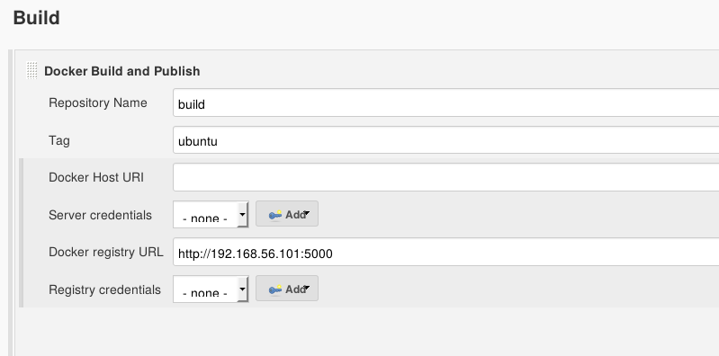

!SLIDE subsection
#~~~SECTION:MAJOR~~~ Integrating Docker With Jenkins

!SLIDE smbullets noprint
# Docker And Jenkins
Common use-cases for Docker in Jenkins are:

* Building Docker containers with Jenkins
* Using Docker containers to run jobs
* Having a Docker container as a Jenkins agent

!SLIDE smbullets printonly
# Building Containers With Jenkins
* Plugin: "CloudBees Docker Build and Publish"
* Build, commit and push containers
* Uses a Dockerfile

!SLIDE smbullets printonly
# Running Jobs Within Docker
* Plugin: "CloudBees Docker Custom Build Environment Plugin"
* Image built from Dockerfile or pulled from a registry
* Useful for running a job in different environments

!SLIDE smbullets printonly
# Docker As Jenkins Agent
* Plugin: "Docker Slaves Plugin"
* Use an image running a Jenkins agent
* Allows easy scaling of Jenkins
  - Especially with Kubernetes

!SLIDE smbullets small
# Lab ~~~SECTION:MAJOR~~~.~~~SECTION:MINOR~~~: Docker Integration
* Objective:
 * Run your project in a Docker container
* Steps:
 * Prepare the Jenkins-master
 * Install the required Plugins
 * Create a new job that builds a container
 * Configure the Python-job to run within Docker
 * Check the result

!SLIDE supplemental exercises
# Lab ~~~SECTION:MAJOR~~~.~~~SECTION:MINOR~~~: Docker Integration

## Objective:

****

* Run your project in a Docker container

## Steps:

****

* Prepare the Jenkins-master
* Install the required Plugins
* Create a new job that builds a container
* Configure the Python-job to run within Docker
* Check the result

!SLIDE supplemental solutions
# Lab ~~~SECTION:MAJOR~~~.~~~SECTION:MINOR~~~: Proposed Solution
## Prepare the Jenkins-master
Start the docker service and the registry

    @@@ sh
    $ sudo usermod -a -G docker jenkins
    $ sudo systemctl restart jenkins
    $ sudo setenforce permissive
    $ sudo systemctl start docker
    $ docker run -d -p 5000:5000 --name registry registry:2

## Install the required Plugins
* Install:
  - "CloudBees Docker Custom Build Environment Plugin"
  - "CloudBees Docker Build and Publish"

* See Lab TODO about Jenkins Plguins

## Create a new job that builds a container
* See Lab TODO about creating jobs

## Configure the Python-job to run within Docker

## Check the result
* Run the job to build the container first
* Then run your Python job
