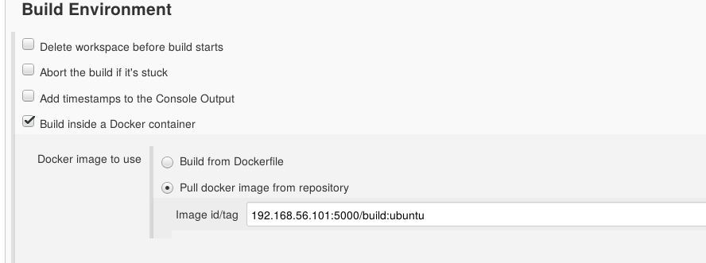

!SLIDE subsection
#~~~SECTION:MAJOR~~~ Integrating Docker With Jenkins

!SLIDE smbullets noprint
# Docker And Jenkins
Common use-cases for Docker in Jenkins are:
* Building Docker containers with Jenkins
* Using Docker containers to run jobs
* Having a Docker container as a Jenkins agent

!SLIDE smbullets printonly
# Building Containers With Jenkins
* Plugin: "CloudBees Docker Build and Publish"
* Build, commit and push containers
* Uses a Dockerfile

!SLIDE smbullets printonly
# Running Jobs Within Docker
* Plugin: "CloudBees Docker Custom Build Environment Plugin"
* Image built from Dockerfile or pulled from a registry
* Useful for running a job in different environments

!SLIDE smbullets printonly
# Docker As Jenkins Agent
* Plugin: Docker Slaves Plugin
* Use an image running a Jenkins agent
* Allows easy scaling of Jenkins
  - Especially with Kubernetes

!SLIDE smbullets small
# Lab ~~~SECTION:MAJOR~~~.~~~SECTION:MINOR~~~: Docker Integration
* Objective:
 * Run your project in a Docker container
* Steps:
 * Install the required Plugins
 * Create job that builds your Docker container
 * Configure the Python job to run within that container
 * Start the build

!SLIDE supplemental exercises
# Lab ~~~SECTION:MAJOR~~~.~~~SECTION:MINOR~~~: Docker Integration

## Objective:

****

* Run your project in a Docker container

## Steps:

****

* Install the required Plugin
* Configure the Job to run within Docker
* Check the result

!SLIDE supplemental solutions
# Lab ~~~SECTION:MAJOR~~~.~~~SECTION:MINOR~~~: Proposed Solution
## Install the required Plugin
* Install:
  - "CloudBees Docker Custom Build Environment Plugin"
* See Lab TODO about Jenkins Plguins

## Create job that builds your Docker container
* See Lab TODO about job creation
* Configure the Job to run within Docker

## Configure the Job to run within Docker

## Check the result
* Run the job again and observe its output
