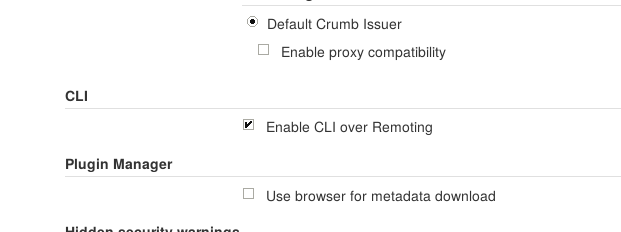

!SLIDE smbullets small
# Lab ~~~SECTION:MAJOR~~~.~~~SECTION:MINOR~~~: Utilise Groovy And The CLI

* Objective:
 * Utilise Groovy And The CLI
* Steps:
 * Set the master executors to 0 through the console
 * Download the Jenkins-cli
 * Enable 'remoting'
 * Activate 'Timestamper' for all jobs via CLI

!SLIDE supplemental exercises
# Lab ~~~SECTION:MAJOR~~~.~~~SECTION:MINOR~~~: Utilise Groovy And The CLI

## Objective:

****

* Utilise Groovy And The CLI

## Steps:

****

* Set the master executors to 0 through the console
* Download the Jenkins-cli
* Enable 'remoting'
* Activate 'Timestamper' for all jobs via CLI

!SLIDE supplemental solutions
# Lab ~~~SECTION:MAJOR~~~.~~~SECTION:MINOR~~~: Proposed Solution

****

## Utilise Groovy And The CLI

****

## Set the master executors to 0 through the console

Go to `jenkins-master:8080/script`
Run:

    @@@ java
	// This just saves us some typing
	import jenkins.model.*

	// Gets an object of the current master, this is actually implicit
	// Use jenkins.instance.getNode( "NodeName" ) to access a node
	def instance = Jenkins.getInstance()

	// Set Executors to Zero
	instance.setNumExecutors(0)

	// Also not really required.
	instance.save()

## Download the Jenkins-cli

Download the Jenkins-cli tool from your master

    @@@ Shell
    wget http://192.168.56.101:8080/jnlpJars/jenkins-cli.jar

## Enable 'remoting'

* Running scripts requires the remoting option
* `Manage Jenkins` -> `Configure Global Security`

~~~PAGEBREAK~~~

## Activate 'Timestamper' for all jobs via CLI

First take a look at the script (~/scripts/enable-timetamper.groovy):

    @@@ Java
    import jenkins.model.Jenkins
    
    for (item in Jenkins.instance.items) {
      println("\njob: $item.name")
      hasTimestamper = false;
      item.buildWrappersList.each {
        if (it instanceof hudson.plugins.timestamper.TimestamperBuildWrapper) {
          hasTimestamper = true;
        }
      }
      if (!hasTimestamper) {
        println(">>>>>>>> Adding timestamper right to $item.name")
        item.buildWrappersList.add(new hudson.plugins.timestamper.TimestamperBuildWrapper());
        item.save()
      }
    }

Run the script through the CLI

    @@@ Shell
    USER=<your_user>
    PASS=<your_password>
    SCRIPT=/home/training/scripts/enable-timestamper.groovy
    $ java -jar ~/jenkins-cli.jar -remoting -s http://192.168.56.101:8080 groovy \
        $SCRIPT --username $USER --password $PASS

