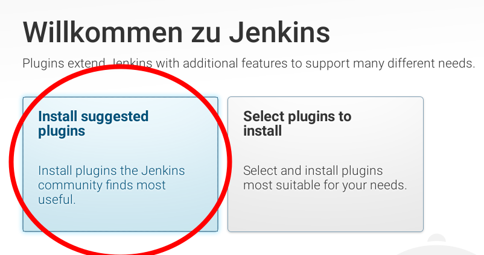
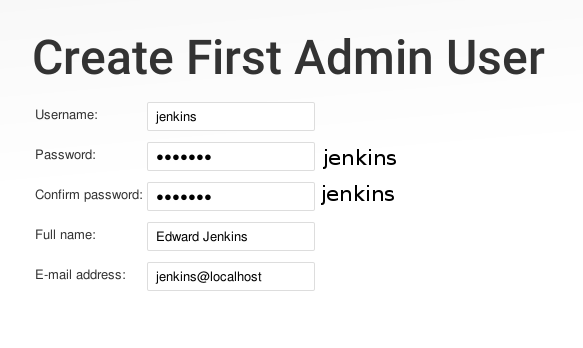

!SLIDE bullets noprint
# Installation
* Java (JDK > 1.7)
* Optional: Tomcat, Glassfish, ...
* Two common ways
 - Package
 - Container + jenkins.war
* Dependencies preinstalled, Repository included

~~~SECTION:notes~~~
Tomcat wird nur gebaucht wenn man es manuel startet
~~~ENDSECTION~~~

!SLIDE smbullets printonly
# Installation
* Java (JDK > 1.7)
* Optional container: Tomcat, Glassfish, ...
* Jenkins offers package repositories. See `https://jenkins.io/download/`

!SLIDE smbullets small
# Lab ~~~SECTION:MAJOR~~~.~~~SECTION:MINOR~~~: Jenkins Installation
* Objective:
 * Install and start Jenkins
* Steps:
 * Install Jenkins using the repository or local package
 * Start the Jenkins service
 * Check Jenkins' status

!SLIDE supplemental exercises
# Lab ~~~SECTION:MAJOR~~~.~~~SECTION:MINOR~~~: Jenkins Installation

## Objective:

****

* Install and start Jenkins

## Steps:

****

* Install Jenkins
* Start the Jenkins service
* Check Jenkins' status

!SLIDE supplemental solutions
# Lab ~~~SECTION:MAJOR~~~.~~~SECTION:MINOR~~~: Proposed Solution

****

## Jenkins Installation

****

## Install Jenkins

Run either

    @@@ shell
    $ sudo yum install -y jenkins

Or 

    @@@ shell
    $ sudo rpm -ihv ~/jenkins-2.7.4-1.1.noarch.rpm

## Start the Jenkins service

    @@@ shell
    $ sudo systemctl start jenkins

## Check Jenkins' status

    @@@ shell
    $ sytemctl status jenkins

!SLIDE bullets noprint
# Up and running
* Default port for Jenkins is `8080`
* Can be configured in `/etc/sysconfig/jenkins`
* Also allows for further Jenkins/Java configurations

You should be able to reach Jenkins form your Browser now:

    @@@ shell
    http://192.168.56.101:8080

!SLIDE smbullets printonly
# Up and running
* Default port for Jenkins is `8080`
* Jenkins/Java configuration in `/etc/sysconfig/jenkins`

Firewall may need to be configured, this is already done for the training VMs

    @@@ Shell
	firewall-cmd --zone=public --add-port=8080/tcp --permanent
	firewall-cmd --reload

!SLIDE smbullets small
# Lab ~~~SECTION:MAJOR~~~.~~~SECTION:MINOR~~~: Setting Up Jenkins
* Objective:
 * Follow the Installation Instructions
* Steps:
 * Find the setup password and enter it
 * Install the suggested plugins
 * Create an initial user

!SLIDE supplemental exercises
# Lab ~~~SECTION:MAJOR~~~.~~~SECTION:MINOR~~~: Setting Up Jenkins

## Objective:

****

* Follow the Installation Instructions

## Steps:

****

* Find the setup password and enter it
* Install the suggested plugins
* Create an initial user

!SLIDE supplemental solutions
# Lab ~~~SECTION:MAJOR~~~.~~~SECTION:MINOR~~~: Proposed Solution

****

## Setting Up Jenkins

****

## Find the setup password and enter it

    @@@ Shell
    $ sudo cat /var/lib/jenkins/secrets/initialAdminPassword

Navigate to `192.168.56.101:8080` in your browser

## Install the suggested plugins

## Create an initial user

