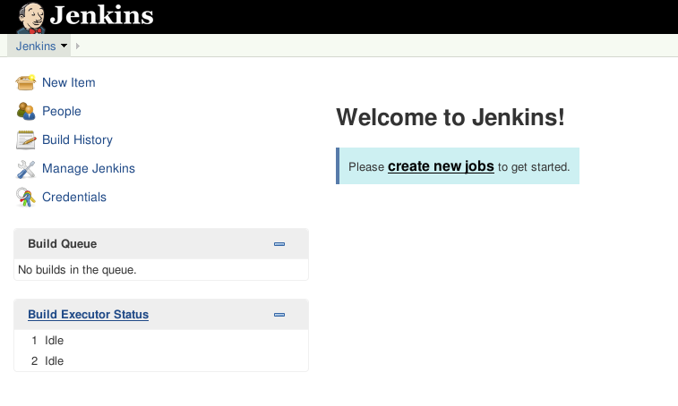

!SLIDE bullets norprint
# Jenkins Web Interface
* Central feature
* Offers an overview for jobs and agents
* Allows configuration
  - Plugins can be installed from here

~~~SECTION:notes~~~

Language by browser environment

~~~ENDSECTION~~~
!SLIDE bullets printonly
# Jenkins Web Interface
* Central feature
* Offers an overview for jobs and agents
* Allows configuration
  - Plugins can be installed from here
* Langauge is set by your browser

!SLIDE fullpage center noprint
#Jenkins Dashboard

!SLIDE smbullets printonly
# Jenkins Dashboard

* Dashboard shows jobs and their status
* `Build Queue` shows pending jobs
* Current job's progress shows as `Executor Status`
* Administration can be accessed via `Manage Jenkins`

~~~SECTION:notes~~~

Possessive 's No Man's sky did it and nobody complained!
Oberfläche, Logo konfigurierbar (wie? link anbieten oder so).

~~~ENDSECTION~~~
