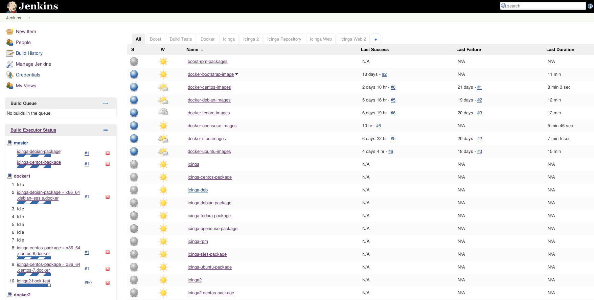

!SLIDE fullpage center noprint
#DIe Weboberfläche

!SLIDE bullets
# Die Weboberfläche

* Dashboard zeigt Jobs und ihren Status an
* `Build Queue` ist die Job-Warteschlange
* Aktueller Job Fortschritt unter `Executor Status`
* Administration via Menü darüber

~~~SECTION:notes~~~

Oberfläche, Logo konfigurierbar (wie? link anbieten oder so).

~~~ENDSECTION~~~

