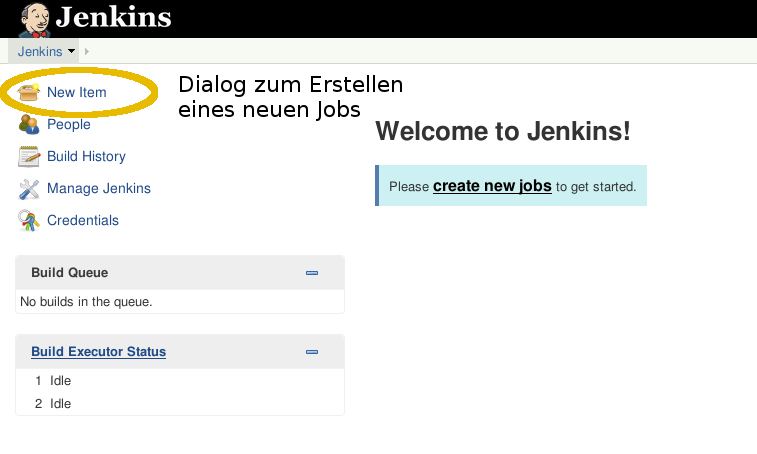

!SLIDE subsection
#~~~SECTION:MAJOR~~~.~~~SECTION:MINOR~~~ Die Weboberfläche

!SLIDE fullpage center noprint
#Die Weboberfläche

!SLIDE fullpage center noprint
#Die Weboberfläche

!SLIDE fullpage center noprint
#Die Weboberfläche

!SLIDE fullpage center noprint
#Die Weboberfläche

!SLIDE fullpage center noprint
#Die Weboberfläche

!SLIDE fullpage center noprint
#Die Weboberfläche

!SLIDE fullpage center noprint
#Die Weboberfläche

!SLIDE fullpage center noprint
#Die Weboberfläche

!SLIDE fullpage center noprint
#Die Weboberfläche

!SLIDE fullpage center noprint
#Die Weboberfläche

~~~SECTION:notes~~~

Executoren wurden im "Architektur" Teil erklärt

~~~ENDSECTION~~~

!SLIDE bullets printonly
# Die Weboberfläche

* Dashboard zeigt Jobs und ihren Status an
* `Build Queue` ist die Job-Warteschlange
* Aktueller Job Fortschritt unter `Executor Status`
* Administration über `Manage Jenkins` und andere Menüs

~~~SECTION:notes~~~

Oberfläche, Logo konfigurierbar (wie? link anbieten oder so).

~~~ENDSECTION~~~

