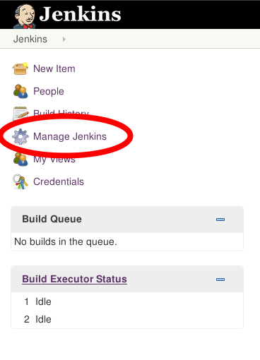
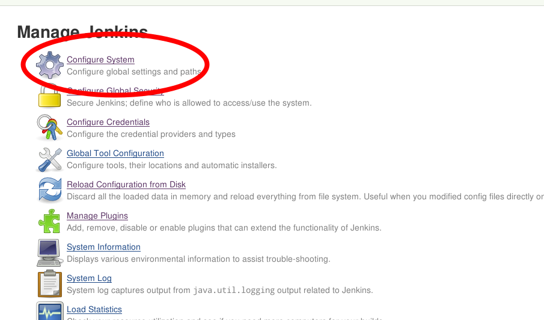
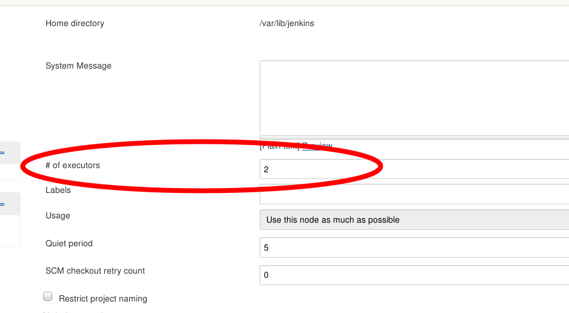

!SLIDE subsection
#~~~SECTION:MAJOR~~~ Configuration

!SLIDE bullets noprint
# Configuration
Jenkins can be configured in two ways

* On the fly through the web interface
* By editing it's config files (XML-formated)

~~~SECTION:notes~~~
Konfigdateien liegen im Homeverzeichnis des jenkins-Benutzers.
~~~ENDSECTION~~~

!SLIDE smbullets printonly
# Configuration
Jenkins can be configured in two ways:

* On the fly through the web interface
* By editing it's config files (XML-formated)

!SLIDE
# Applying config changes
After making changes to Jenkins' files, it needs to be made aware of these changes.

Either by restarting Jenkins from the console

    @@@ Shell
    sudo systemctl restart jenkins

Or by clicking the the correct button

    @@@ Shell
	'Manage Jenkins' ->  
	'Reload Configuration from Disk'

Or using the API

	@@@ Shell
    http://jenkins-master:8080/reload  

~~~SECTION:notes~~~
Auch Befehle wie 'restart' oder 'exit' können per url ausgeführt werden.
TODO: Add to cheatsheet
~~~ENDSECTION~~~

!SLIDE smbullets small
# Lab ~~~SECTION:MAJOR~~~.~~~SECTION:MINOR~~~: The Two Ways Of Configuration

* Objective:
 * Change the number of executors
* Steps:
 * Navigate to the `Manage Jenkins`-menu
 * `Configure System` to change the number of executors to 5
 * shh into the jenkins master (`ssh 192.168.56.101, passwd 'netways'`)
 * Find the 'Jenkins-Home' at `/var/lib/jenkins`
 * Edit the `config.xml` and set the executors back to 3
 * Reload Jenkins

!SLIDE supplemental exercises
# Lab ~~~SECTION:MAJOR~~~.~~~SECTION:MINOR~~~: The Two Ways Of Configuration

## Objective:

****

* Change the number of executors

## Steps:

****

* Navigate to the `Manage Jenkins`-menu
* `Configure System` to change the number of executors to 5
* shh into the jenkins master (`ssh jenkins-master, passwd 'netways'`)
* Find the 'Jenkins-Home' at `/var/lib/jenkins`
* Edit the `config.xml` and set the executors back to 3
* Reload Jenkins

!SLIDE supplemental solutions
# Lab ~~~SECTION:MAJOR~~~.~~~SECTION:MINOR~~~: Proposed Solution

****

## The Two ways of Configuration

****

## Webinterface:

## Configuration Files:

    @@@ Shell
    $ cd /var/lib/jenkins
    $ sudo vim config.xml

        <numExecutors>3</numExecutors>

    $ sudo systemctl restart jenkins

!SLIDE smbullets
# Backing Up Your Jenkins
* Changes made in the web front-end are immediately written into the config files
* Everything is contained within $JENKINS\_HOME
* Making a backup can be as easy as just copying the whole directory
  - Leads to enormous backups (Workspaces etc. are also in $JENKINS\_HOME)
* All that's needed are XLM files and their path

~~~SECTION:notes~~~
https://gist.github.com/abayer/527063a4519f205efc74
~~~ENDSECTION~~~
