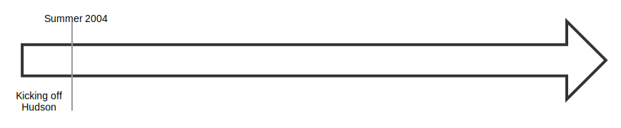

!SLIDE noprint
#Elevator pitch
> Jenkins is an open source automation server which enables developers around
> the world to reliably build, test, and deploy their software.

!SLIDE printonly
#Elevator pitch
> Jenkins is an open source automation server which enables developers around
> the world to reliably build, test, and deploy their software.

~~~SECTION:notes~~~

Jenkins ist ein Open Source automations-Server der es Entwicklern überall
ermöglicht software zuverlässig zu bauen, testen und bereitzustellen.

TODO: Jenkins Feature set?

~~~ENDSECTION~~~

!SLIDE fullpage center noprint
#Jenkins Timeline

~~~SECTION:notes~~~

Kohsuke Kawaguchi (Sun)  
Continous Integration software
Mangel an CI software 

~~~ENDSECTION~~~

!SLIDE fullpage center noprint
#Jenkins Timeline

~~~SECTION:notes~~~

Hudson auf java.net unter der MIT License veröffentlicht

~~~ENDSECTION~~~

!SLIDE fullpage center noprint
#Jenkins Timeline

~~~SECTION:notes~~~

Hudson ist erfolgreich.  
Dezember 2010.  
Oracle kauft Sun. Oracle will sich ein trademark auf Hudson sichern.  

~~~ENDSECTION~~~

!SLIDE fullpage center noprint
#Jenkins Timeline

~~~SECTION:notes~~~

Community Wahl Namenswechsel zu Jenkins.  
Oracle entwickelt Hudson weiter.  
Beide sehen einander als fork an.

~~~ENDSECTION~~~

!SLIDE fullpage center noprint
#Jenkins Timeline

~~~SECTION:notes~~~

Hudson wird von Oracle an die Eclipse foundation übergeben.  
Kawaguchi sieht das als Sieg für Jenkins.

~~~ENDSECTION~~~

!SLIDE fullpage center noprint
#Jenkins Timeline

~~~SECTION:notes~~~

100.000 Installationen  
Über 600 Projekt Mitglieder  
Über 1000 Github Repositories  

Hudson: ~30 Mitglieder/20 Repositories

~~~ENDSECTION~~~

!SLIDE printonly
#Jenkins Timeline

!SLIDE bullets noprint
# Future Development
* Push for Piplines
 - Jenkins 2.0 having Pipline as a default Plugin
 - Blue Ocean as visualisation tool
 - Change of Introductory Material

~~~SECTION:notes~~~

Pipeline wird erwähnt wenn noch Zeit ist
Default Plugins werden wir bei der Installation sehen
Blue Ocean kommt nicht vor

~~~ENDSECTION~~~

!SLIDE smbullets printonly
# Future Development
* Push for Piplines
 - Jenkins 2.0 having Pipline as a default Plugin
 - Blue Ocean as visualisation tool
 - Change of Introductory Material

!SLIDE bullets noprint
#Feature Set
* Easy to install
* Configuration in a Webinterface
  - Persists as XML files
* Extendable with plugins
* Supports a distributed architecture

!SLIDE smbullets printonly
#Feature Set
* Easy to install
* Configuration in a Webinterface
  - Persists as XML files
* Extendable with plugins
* Supports a distributed architecture

!SLIDE bullets noprint
# Comparing Jenkins To Other CI/CD Tools
* Free Software (Free Speech and free beer)
* Active community and development
* THE CI/CD software

~~~SECTION:notes~~~

Buildbot ist kompliziert, teamcity teuer und gitlab ci steckt noch in den Kinderschuhen
Alle anderen tools müssen sich an Jenkins messen

~~~ENDSECTION~~~

!SLIDE smbullets printonly
# Comparing Jenkins To Other CI/CD Tools
* Free Software
* Active community and development
* Most prominent and CI/CD tool
