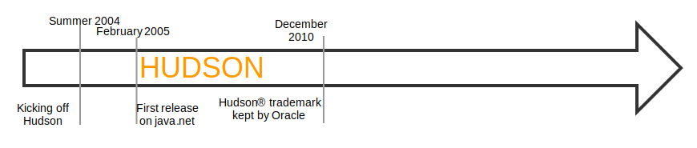
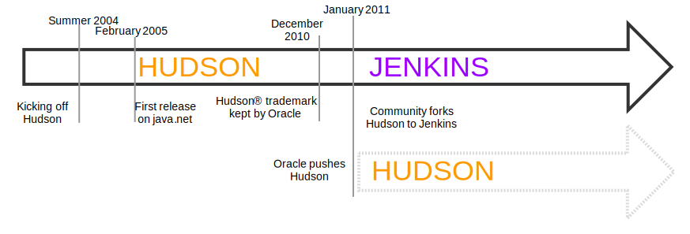
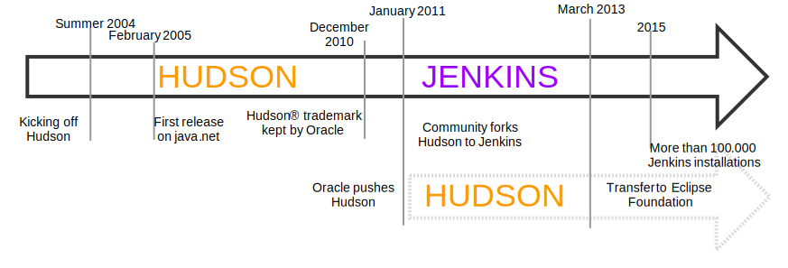

!SLIDE
#Elevator pitch
> Jenkins is an open source automation server which enables developers around
> the world to reliably build, test, and deploy their software.

~~~SECTION:notes~~~

Jenkins ist ein Open Source automations-Server der es Entwicklern überall
ermöglicht software zuverlässig zu bauen, testen und bereitzustellen.

TODO: Jenkins Feature set?

~~~ENDSECTION~~~

!SLIDE fullpage center noprint
#Jenkins Timeline

~~~SECTION:notes~~~

Kohsuke Kawaguchi (Sun)  
Continous Integration software
Mangel an CI software 

~~~ENDSECTION~~~

!SLIDE fullpage center noprint
#Jenkins Timeline

~~~SECTION:notes~~~

Hudson auf java.net unter der MIT License veröffentlicht

~~~ENDSECTION~~~

!SLIDE fullpage center noprint
#Jenkins Timeline

~~~SECTION:notes~~~

Hudson ist erfolgreich.  
Dezember 2010.  
Oracle kauft Sun. Oracle will sich ein trademark auf Hudson sichern.  

~~~ENDSECTION~~~

!SLIDE fullpage center noprint
#Jenkins Timeline

~~~SECTION:notes~~~

Community Wahl Namenswechsel zu Jenkins.  
Oracle entwickelt Hudson weiter.  
Beide sehen einander als fork an.

~~~ENDSECTION~~~

!SLIDE fullpage center noprint
#Jenkins Timeline

~~~SECTION:notes~~~

Hudson wird von Oracle an die Eclipse foundation übergeben.  
Kawaguchi sieht das als Sieg für Jenkins.

~~~ENDSECTION~~~

!SLIDE fullpage center noprint
#Jenkins Timeline

~~~SECTION:notes~~~

100.000 Installationen  
Über 600 Projekt Mitglieder  
Über 1000 Github Repositories  

Hudson: ~30 Mitglieder/20 Repositories

~~~ENDSECTION~~~

!SLIDE fullpage center
#Jenkins Timeline

!SLIDE bullets
#Und was kommt noch?
* Jenkins 2.0
  - Eigendlich nur Jenkins 1.659
* Blue Ocean
  - Bessere Visualisierung

!SLIDE bullets
#Feature Set
* Einfach zu installieren
* Konfiguration per Webinterface
  - Konfiguration besteht im XML Format
* Erweiterbar mit Plugins
* Skalierbar dank verteilter Architektur

!SLIDE bullets
#Jenkins und andere CI/CD tools
* Frei und kostenlos
* Aktive Community und Enwicklung
* Der de-facto Standard
* Erweiterbar und einfach zu bedienen

~~~SECTION:notes~~~

Buildbot ist kompliziert, teamcity teuer und gitlab ci steckt noch in den Kinderschuhen

~~~ENDSECTION~~~

