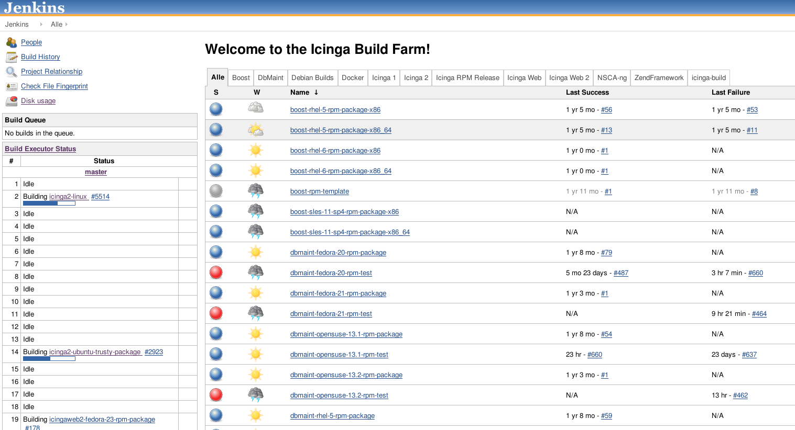

!SLIDE bullets noprint
#Jenkins bei NETWAYS und Icinga
* Verwendung intern:
  - Build und Push von Dockerimages, angestoßen durch Änderungen im SCM
  - CI/CD von Rails- und Sinatra-Apps
  - Testen von Puppetmodulen

* Als Buildplattform für Icinga-Pakete (RPM, DEB)

!SLIDE smbullets printonly
#Jenkins bei NETWAYS und Icinga
* Verwendung intern:
  - Build und Push von Dockerimages, angestoßen durch Änderungen im SCM
  - CI/CD von Rails- und Sinatra-Apps
  - Testen von Puppetmodulen

* Als Buildplattform für Icinga-Pakete (RPM, DEB)

!SLIDE fullpage center noprint
#Altes build.icinga.org

