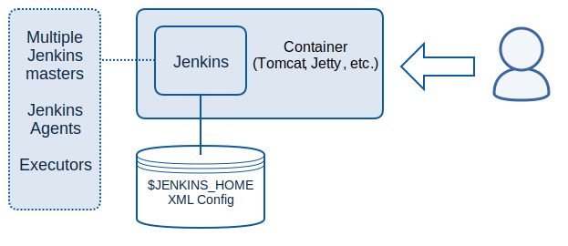

!SLIDE center noprint
# Architecture

~~~SECTION:notes~~~

Container: Ein Java-Webserver (Alternativen: Glassfish, Geronimo)  
Jenkins: Jenkins Java application (.WAR)  
Config: Als XML in $JENKINS\_HOME, z.B /var/lib/jenkins
Executoren: Plätze auf denen Jobs laufen können.
Es laufen maximal so viele Jobs parallel wie Executoren frei sind

~~~ENDSECTION~~~

!SLIDE printonly
# Architecture

!SLIDE smbullets printonly
# Architecture
* Jenkins runs in a Container (Tomcat, Glasfish...)
* All Configuration is saved in XML files in the Jenkins Home
* Jenkins can communicate with other Jenkins instances

