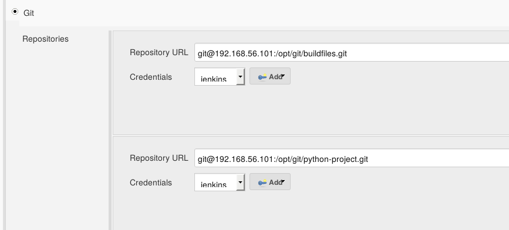
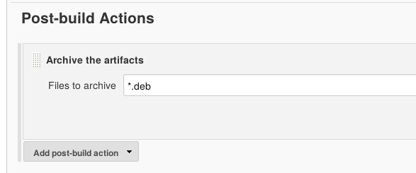
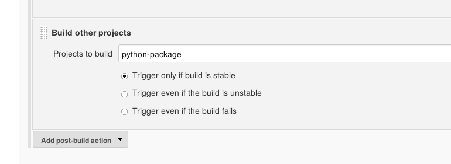

!SLIDE bullets noprint
# Creating a Process
* Single step jobs have limited usabilty
* Jobs can be chained together using conditions
* Allows to represent a multi-step proccess

~~~SECTION:notes~~~
import key gpg --import something.asc
~~~ENDSECTION~~~

!SLIDE bullets noprint
# Chaining
* The Python job now requires the docker job to be built first
* There are multiple ways to model this dependency with Jenkins

~~~SECTION:notes~~~
Schlägt fehl wegen mangelnder files

~~~ENDSECTION~~~

!SLIDE smbullets printonly
# Chaining
* The Python job now requires the docker job to be built first
* There are multiple ways to model this dependency with Jenkins

!SLIDE bullets noprint
# Why We Don't Use A Build Trigger
* 'Build after other projects are built' is not a good choice in this case
* Traceability suffers
* Useful for downstream and cleanup jobs

~~~SECTION:notes~~~
Nachverfolgbarkeit von Fehlern leidet
Daher nicht zu empfehlen bei upstream jobs
~~~ENDSECTION~~~

!SLIDE smbullets printonly
# Why We Don't Use A Build Trigger
* 'Build after other projects are built' is not a good choice in this case
* Traceability suffers
* Useful for downstream and cleanup jobs

!SLIDE bullets noprint
#Chaining
* `Clone Workspace SCM Plug-in`
  - Since jenkins 2.1 multiple SCM can be used
* Alternatively: Use Artifacts

~~~SECTION:notes~~~
Im 1. job als post built action archivieren, im 2. job als scm holen
~~~ENDSECTION~~~

!SLIDE bullets noprint
#Complex build chains
* `conditional-buildstep` plugin
 - Build steps executed on bool conditions
* `Multi-job` plugin
 - Allows running jobs in parallel
 - Looks fancy

!SLIDE smbullets printonly
#Complex build chains
* `conditional-buildstep` plugin
 - Build steps executed on bool conditions
* `Multi-job` plugin
 - Allows running jobs in parallel
 - Looks fancy

!SLIDE smbullets small
# Lab ~~~SECTION:MAJOR~~~.~~~SECTION:MINOR~~~: Automating The Package Building Process
* Objective:
 * Build a deb package of your project
* Steps:
 * Create a new job
 * Chain the jobs

!SLIDE supplemental exercises
# Lab ~~~SECTION:MAJOR~~~.~~~SECTION:MINOR~~~: Automating The Package Building Process

## Objective:

****

* Build a deb package of your project

## Steps:

****

* Create a new job
* Multiple SCMs
* Build inside Docker
* Buildstep
* Archive artifacts
* Build dependencies

!SLIDE supplemental solutions
# Lab ~~~SECTION:MAJOR~~~.~~~SECTION:MINOR~~~: Proposed Solution

****

## Automating The Package Building Process

****

## Create a new job

* You know how to do this!
* See earlier Labs for more info

## Multiple SCMs

* You can define as many Repositories as you want

## Build inside Docker

See Docker Lab for further information

    @@@ Shell
	192.168.56.101:5000/build:ubuntu

~~~PAGEBREAK~~~

## Archive artifacts
* Archiving artifacts makes Jenkins keep them across builds
* It also saves them from being destroyed along with the Docker container

## Buildstep
Add as a new 'Execute Shell'-command:

    @@@ Shell
	# Build the package
    debuild --no-tgz-check -uc -us

	# Move the package back into the workspace (debuild is weird)
	mv ../*.deb .

## Model the build dependencies

* Use a post-build action in the Python project to make sure the packaging job runs after it

