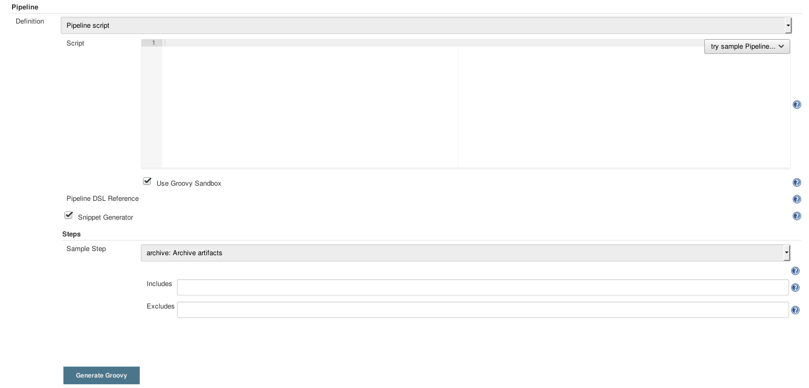

!SLIDE
#Zuviele Plugins?
Immer mehr Plugins führen zu immer mehr Abhängigkeiten. Die Übersicht leidet 
und der Overhead alles zu verwalten steigt.

Was tun?

!SLIDE bullets
#Workflow/Pipeline Plugin
* 'Pipeline' Plugin installieren
  - Ehemals "Workflow Plugin"
  - Der empfohlene Weg Jobs zu erstellen
  - Aber: Sehr komplex

~~~SECTION:notes~~~

Ehemals "Workflow", heisst noch so in älterer Dokumentation
Mit Jenkins 2.0 als zentraler Projekttyp empfohlen

Erklärung nächste Folie

~~~ENDSECTION~~~

!SLIDE center
#Workflow/Pipeline Plugin
Neues (Pipeline) Projekt erstellen

!SLIDE center
#Pipeline Script

~~~SECTION:notes~~~

'Pipeline Syntax' Klicken für Code Generator
Definition per Hand oder aus SCM

~~~ENDSECTION~~~

!SLIDE bullets
#Pipeline Script
* Eigendlich Groovey Script
* Jenkins Spezifische Deklarationen
* 'Pipeline Syntax': Snippet Editor

!SLIDE bullets
#Pipeline Syntax
* `Stage`
  - Logische Einheit zur Visualisierung
* `Node`
  - Mehrere Steps mit flüchtigem Workspace
* `Step`
  - Einzelner Schritt in einem Job

~~~SECTION:notes~~~
Node: Mehrere Steps da Workspace erstellen und löschen ein Schritt ist
~~~ENDSECTION~~~

!SLIDE bullets
#Freestyle zu Pipleine
Wir wollen unser Python Projekt zu einem Pipline Projekt umauben
* `Pipeline Syntax`
* `checkout: General SCM`
* Ausfüllen
* `Generate Groovy`

!SLIDE bullets
#Freestyle zu Pipleine
* Der checkout muss mit einem `node { }` umschlossen werden
* Stages sind optional:
  - `stage 'SCM'`
  - Stages sind aktiv bis eine neue Stage deklariert wird

~~~SECTION:notes~~~

Langsam ausklingen lassen, Extra teil ankündigen

~~~ENDSECTION~~~
